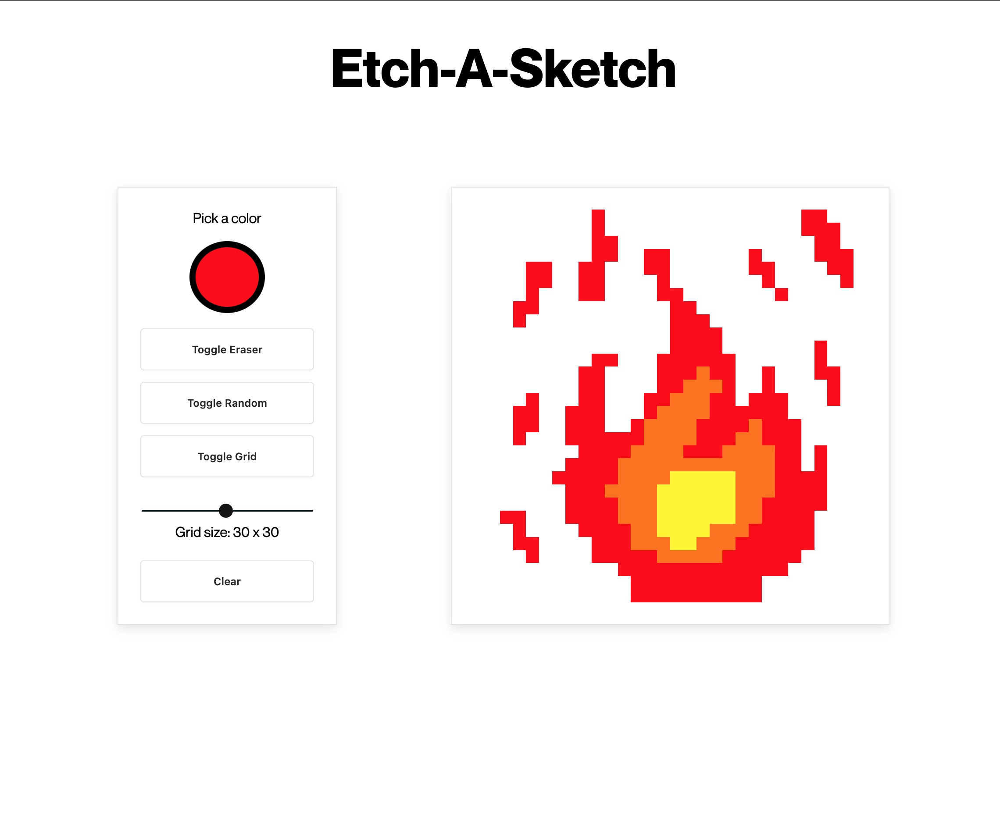

# Etch-a-Sketch

## Subject

A browser version of something between a sketchpad and an Etch-A-Sketch.

## Features

- A button to choose a color

- A button to erase

- A button to randomize a color

- A button to hide the grid

- A slider to change the size of the grid

- A button to clear

## Tech Stack

**Client:** HTML - CSS - JavaScript

## Screenshot

